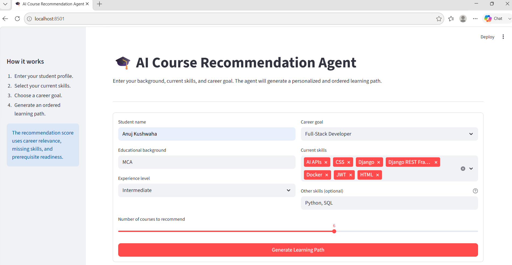
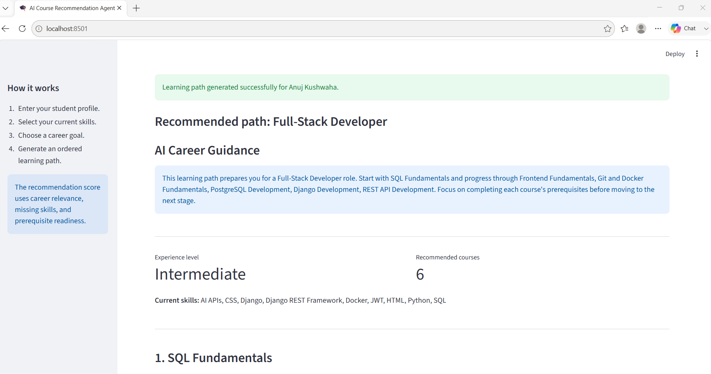
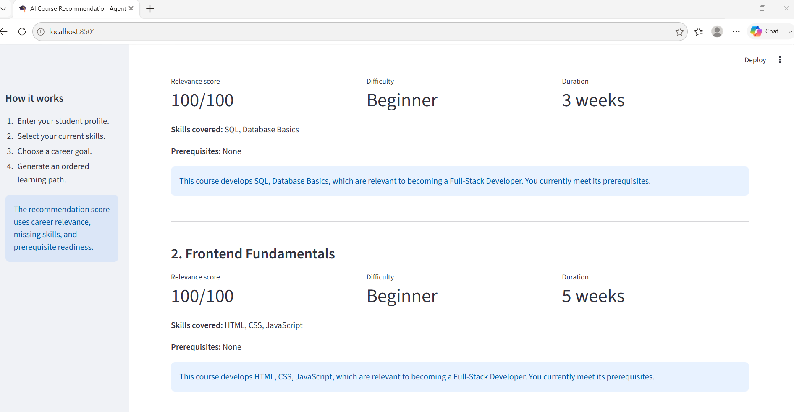
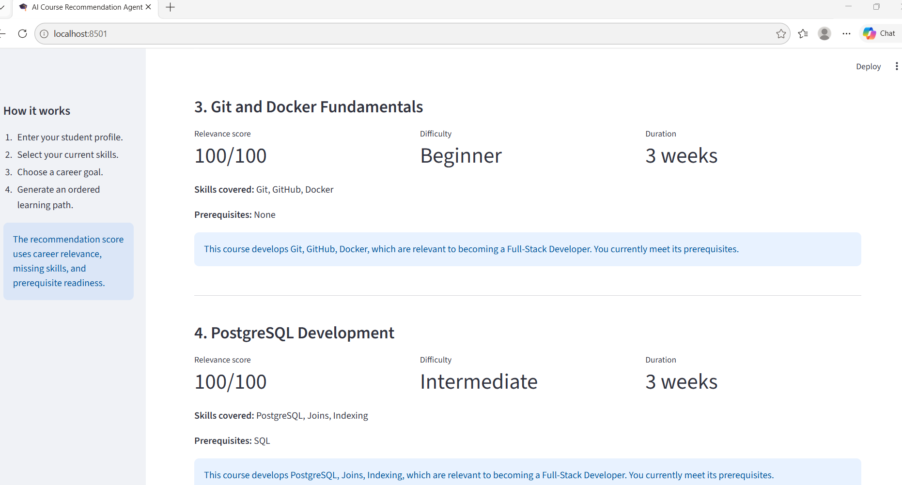
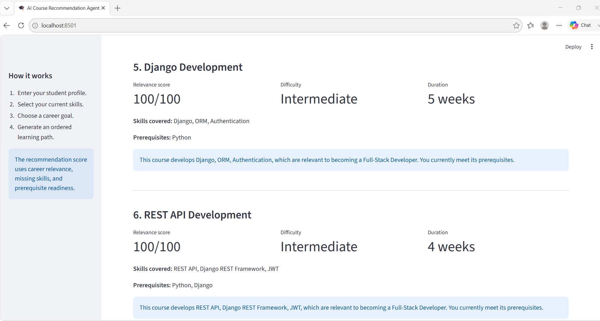

	AI Course Recommendation Agent

	An AI-powered learning-path agent that recommends an ordered list of courses based on a student's educational background, existing skills, experience level, and career goal.

	The application combines a transparent rule-based recommendation engine with Groq-powered personalized career guidance.

	 Problem Statement

	Students often struggle to decide:

o	Which skills they should learn
o	Which course they should start with
o	Whether they meet course prerequisites
o	How their learning path supports their career goal

	This agent converts a student profile into a scored and ordered learning path with a clear reason for every recommendation.

	 Agent Objective

The agent takes a student's background, current skills, experience level, and career goal and produces an ordered learning path with relevance scores and explanations.

	 Features

•	Accepts student background and current skills
•	Supports five career paths
•	Uses a structured course catalogue
•	Checks course prerequisites
•	Identifies missing skills
•	Calculates transparent relevance scores
•	Produces an ordered learning path
•	Generates personalized guidance using Groq
•	Works without an API key using fallback explanations
•	Exports recommendations as JSON
•	Includes sample profiles, outputs, and automated tests

•	 Supported Career Goals

o	Python Backend Developer
o	Full-Stack Developer
o	Data Analyst
o	Machine Learning Engineer
o	Generative AI Engineer

	 Technology Stack

o	Python
o	Streamlit
o	Groq API
o	JSON
o	Pytest
o	Git and GitHub

	 Project Structure

	text
	course-recommendation-agent/
	├── app.py
	├── recommender.py
	├── llm_service.py
	├── generate_samples.py
	├── requirements.txt
	├── README.md
	├── .env.example
	├── .gitignore
	├── data/
	│   ├── courses.json
	│   └── sample_profiles.json
	├── outputs/
	│   ├── python_backend_developer_path.json
	│   ├── data_analyst_path.json
	│   ├── machine_learning_engineer_path.json
	│   └── generative_ai_engineer_path.json
	├── screenshots/
	└── tests/
	└── test_recommender.py
	

	 How the Agent Works

	The application follows this workflow:

	Accept a student profile.
	Load the course catalogue from JSON.
	Filter courses relevant to the selected career goal.
	Remove courses whose skills the student already knows.
	Check prerequisite readiness.
	Calculate a relevance score.
	Arrange courses in a suitable learning order.
	Generate personalized AI career guidance.
	Display and export the final learning path.

	 Recommendation Method

	Each course receives a score out of 100:

	| Scoring factor | Weight |
	|---|---:|
	| Career-goal relevance | 50 points |
	| Missing-skill value | 20 points |
	| Prerequisite readiness | 30 points |

	The ordering logic prioritizes:

	Courses whose prerequisites are already satisfied
	Beginner courses before intermediate and advanced courses
	Courses with higher relevance scores

	The LLM does not select or score courses. It only explains the generated learning path. This keeps recommendations reproducible and reduces hallucination risk.

	 Installation

	1. Clone the repository

	bash
	git clone https://github.com/anuj-kush/Course-Recommendation-Agent
	cd course-recommendation-agent

	2. Create a virtual environment

	Windows CMD:

	cmd
	python -m venv venv
	venv\Scripts\activate
	

	macOS or Linux:

	bash
	python3 -m venv venv
	source venv/bin/activate
	

	3. Install dependencies

	bash
	pip install -r requirements.txt
	

	 API Configuration

	Create a .env file in the project root:

	env
	GROQ_API_KEY=your_actual_groq_api_key
	GROQ_MODEL=openai/gpt-oss-20b
	

	A Groq API key is optional. If it is unavailable or invalid, the application uses a deterministic fallback summary and continues working.

	Never commit the .env file or API key to GitHub.

	 Run the Application

	bash
	streamlit run app.py
	

	Open the displayed URL, normally:

	text
	http://localhost:8501
	

	 Generate Sample Outputs

	bash
	python generate_samples.py
	

	This generates reproducible JSON learning paths inside the outputs directory.

	 Run Automated Tests

	pytest -v

	The tests cover:

o	Course catalogue loading
o	Career-goal filtering
o	Maximum recommendation limit
o	Already-known skill filtering
o	Recommendation scoring
o	Missing prerequisites
o	Empty career-goal validation
o	Sequential learning-path ordering

	 Sample Input

	json
	{
	"name": "Anuj",
	"education": "MCA",
	"current_skills": [
	"Python",
	"SQL",
	"Django"
	],
	"career_goal": "Python Backend Developer",
	"experience_level": "Intermediate"
	}
	

	 Sample Output

	json
	{
	"order": 1,
	"course": "Git and Docker Fundamentals",
	"score": 100,
	"difficulty": "Beginner",
	"duration_weeks": 3,
	"skills": [
	"Git",
	"GitHub",
	"Docker"
	],
	"prerequisites": [],
	"missing_prerequisites": [],
	"reason": "This course develops skills relevant to becoming a Python Backend Developer."
	}
	

	Complete reproducible outputs are available in the outputs directory.

	 Application Screenshots

	Student Profile Form

	

	AI Career Guidance

	

	Recommended Learning Path

	

   

   

	 Sample Profiles

	The repository contains four sample profiles:

	MCA student targeting Python backend development
	Commerce graduate targeting data analysis
	B.Tech student targeting machine learning
	BCA student targeting Generative AI engineering

	 Design Decisions

	Rule-based scoring

	A transparent scoring method was used instead of allowing the LLM to rank courses. This makes recommendations explainable, testable, and consistent.

	JSON storage

	JSON was selected because the catalogue is small, portable, easy to review, and does not require database configuration.

	Single LLM request

	Only one LLM request is made for the overall career summary. This reduces latency, API usage, and rate-limit risk.

	Graceful fallback

	The core application does not depend on an external API. If Groq is unavailable, course scoring and learning-path generation still work.

•	 Tradeoffs and Limitations

o	The course catalogue is intentionally small.
o	Career goals are currently limited to five predefined options.
o	Skill relationships use manually defined metadata.
o	Recommendations do not currently include real course-provider links.
o	Rule-based skill matching does not detect all synonyms.
o	The application does not track course completion.
o	AI guidance depends on the quality and availability of the selected model.

•	 Future Improvements

•	With more development time, the project could include:

o	Semantic skill matching using embeddings
o	A larger course catalogue
o	Real course-provider integrations
o	User accounts and progress tracking
o	Course feedback and rating signals
o	Adaptive recommendations based on completed courses
o	Admin interface for catalogue management
o	Cloud deployment and persistent storage

•	 Responsible AI Considerations

o	The scoring method is visible and explainable.
o	The LLM cannot modify recommendation scores.
o	The application does not guarantee employment or salary outcomes.
o	API failures are handled without exposing secret keys.
o	Recommendations should be treated as learning guidance, not definitive career advice.

•	 Author
    
    Anuj Kushwaha
